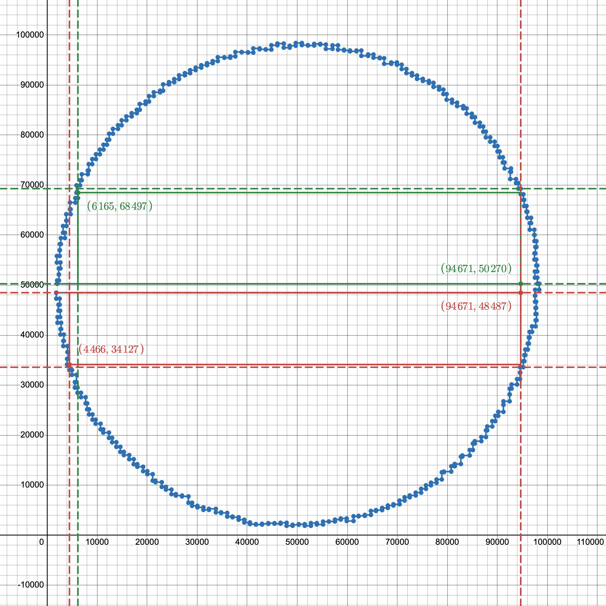

# Puzzle 2

Due to the specifics of the input, I've decided to solve part 2 manually.

## Steps

1. Plot the red tiles and connect them. I used Desmos for this purpose.
2. Observe that the plot is an irregular circle with a long gap in the middle.
3. Empirically assume that the largest rectangle corner has to be one of the tiles that create the gap. Additionally,
   assume that no red tiles are inside the largest rectangle.
4. Draw dashed "constraint lines" based on the above assumptions. The largest rectangle has to be inside one of the two
   areas created by the constraints.
5. Find the red tiles that create the largest rectangles within the areas.
6. Calculate the area of the larger rectangle.

Desmos graph: https://www.desmos.com/calculator/ngmsfkfuwl

